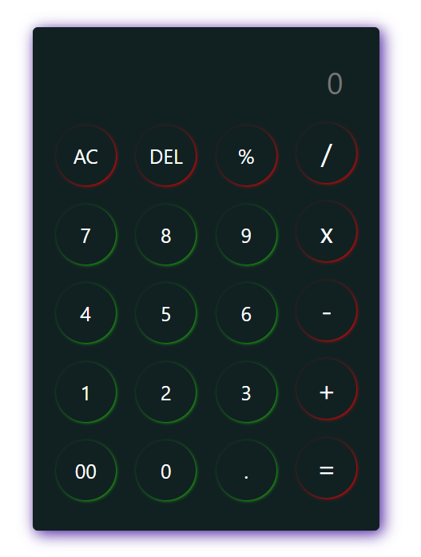

<h1>Fully Functional calculator</h1>
    <b>Tech Stack : </b>HTML, CSS, JAVASCRIPT  
    
<b>Description : </b>We can do multiple operation like Addition, Subtraction, Division, Multiplication and Modulo Division. In this Calculator the percentage (%) symbol indicates modulo division operator, it gives remainder as output.

    <h2>Screenshot</h2>
    
